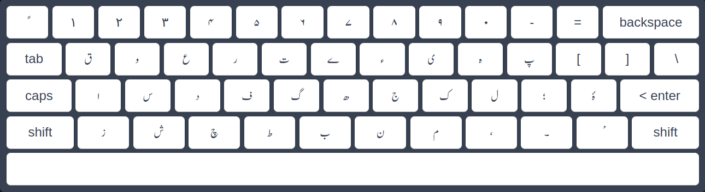
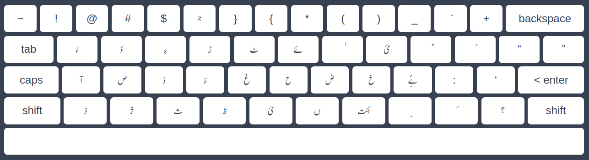

# BalochInputExtension  

A browser extension that enables seamless **Balochi typing** across websites. This tool provides a custom keyboard mapping for Balochi text entry and works on **both Chrome and Firefox**.

## Features  
- **Keyboard Shortcut:** Toggle Balochi input mode on/off with **Ctrl + Space**.  
- **Right-to-Left (RTL) Support:** Automatically switches text direction to RTL in input fields when Balochi mode is active.  
- **Custom Keyboard Mapping:** Type in Balochi using a predefined layout.  
- **Multi-Browser Support:** Works on **Google Chrome** and **Mozilla Firefox**.  
- **Privacy Focused:** No user data is collected; only required permissions are requested.

## Installation  

### Chrome  
1. Download or clone this repository:
   ```bash
   git clone https://github.com/your-username/BalochInputExtension.git
   ```
2. Open `chrome://extensions/` in Chrome.  
3. Enable **Developer Mode**.  
4. Click **Load unpacked** and select the extension folder.

### Firefox  
The extension is available on the Firefox Add-ons store:  
[Install Balochi Input Tool](https://addons.mozilla.org/en-US/firefox/addon/balochi-input-tool/)

Alternatively, you can install it manually:  
1. Go to **about:addons** in Firefox.  
2. Click the gear icon and select **Install Add-on From File...**.  
3. Navigate to `dist/firefox/` and select the `.xpi` file.

## Usage  
1. Press **Ctrl + Space** to activate or deactivate Balochi mode.  
2. Type using the mapped keyboard layout (see included screenshot).  
3. Input fields automatically switch to **RTL mode** when Balochi input is active.

## Keyboard Mapping  
Below are the Balochi keyboard layouts:

**Normal Layout:**  


**Shift Key Enabled Layout:**  


## Development  
1. Fork the repository and create a new branch for your changes.  
2. Make your modifications and submit a pull request.

## Permissions  
The extension requires access to all websites to enable Balochi typing anywhere. No data is collected or stored.
